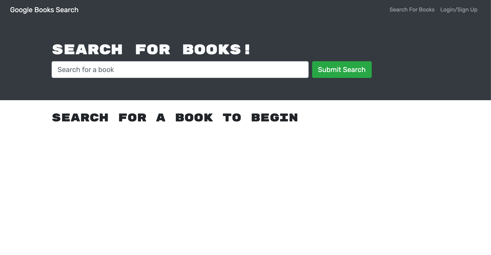
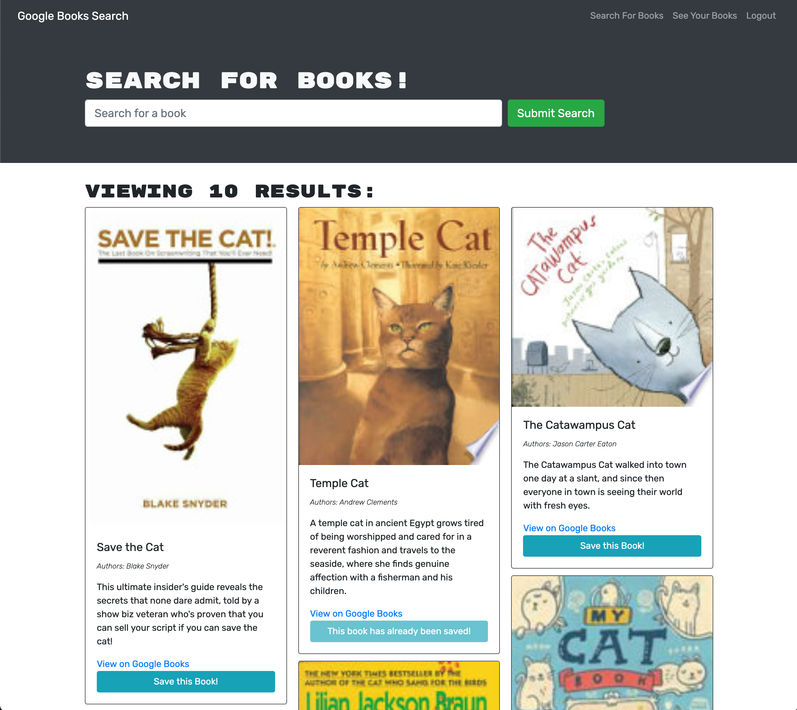

# Book Search Engine

## MERN Challenge

## Description
This weeks module challenge is focused on our knowledge of the MERN tech stack (MongoDB, Express.js, React, and Node.js) as well as introducing GraphQL, Apollo Server, and JSON Web Tokens. The starter code contained a fully-functioning Book Search Engine using the Google Books API search engine built with a RESTful API. The challenge is to refactor the app to use a GraphQL API with Apollo Server and Apollo Client. GraphQL is an API query language that returns the data we need and nothing more. Apollo Server allows for GraphQL integration with the Express.js server and Apollo Client integrates GraphQL with React. And JSON Web Tokens are another way of using session cookies for user authentication. 

Deployed Application: https://book-search-engine-eh.herokuapp.com/

## Table of Contents
* [Installation](#installation)
* [Usage](#usage)
* [Deployed Application](#deployed-application)
* [Screenshots](#screenshots)
* [Questions](#questions)

## Installation
To install all necessary dependencies run the following command: 

    npm install

## Usage
For local usage, clone the repo on you local manchine and open in an IDE. If you haven't already, make sure you have node.js installed as well as npm (check installation: `node -v` & `npm -v`). In the packages root directory, run `npm i` to install the necessary dependencies. Running `npm i` from the root directory will install dependencies for the client and server directories. If you run into issues installing, try deleting all `package-lock.json` files, then running `npm i` from the root. Once installation complete, run `npm run develop` from the root directory to concurrently start both the client-side React server and server-side Express.js server. If both servers start up correctly, the app should launch in your default browser.

## Deployed Application
https://book-search-engine-eh.herokuapp.com/

## Screenshots

## Questions
If you have any questions or feedback, create a new issue and add the label "question". 
View more of my work: [github.com/emholmes](https://github.com/emholmes).
